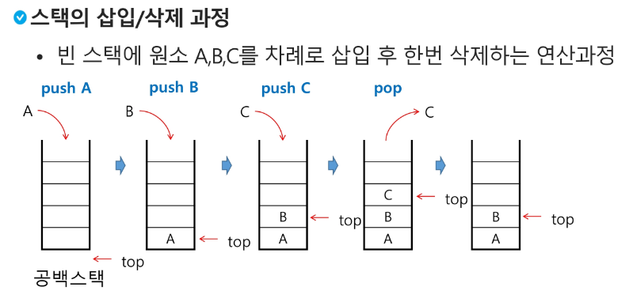

# 0806 Stack

### 오늘 실습을 통해 배운 내용
- [Stack 정리](https://bitter-cloth-1a0.notion.site/4280d296b49f45a599353cb1306fadb6)
- 스택(stack)의 특성
  - 물건을 쌓아 올리듯 자료를 쌓아 올린 형태의 자료구조
  - 스택에 저장된 자료는 선형 구조를 갖는다
    - 선형 구조 : 자료 간의 관계가 1대1의 관계를 갖는다.
    - 비선형 구조 : 자료 간의 관계가 1대N의 관계를 갖는다.(ex. 트리)
  - `후입선출(LIFO, Last-In-First-Out)` : 마지막에 삽입한 자료를 가장 먼저 꺼낸다.
- 스택의 구현
  - 자료구조 : 자료를 선형으로 저장할 저장소
    - 배열을 사용할 수 있다.
    - 저장소 자체를 스택이라 부르기도 한다.
    - 스택에서 마지막 삽입된 원소의 위치를 `top`이라 부른다.
  - 연산
    - 삽입 `push` : 저장소에서 자료를 저장
    - 삭제 `pop` : 저장소에서 삽입한 자료의 역순으로 자료를 꺼낸다.
    - `isEmpty` : 스택이 공백인지 아닌지를 확인
    - `peek` : 스택의 top에 있는 item을 반환
    - 빈 스택에 원소 A,B,C를 차례로 삽입 후 한번 삭제하는 연산과정 
  
  
  1.  스택의 push 알고리즘
      ```python
      def push(item, size):
        global top
        top += 1
        if top == size:
          print('overflow!')    # 가득 차있는지 확인!
        else:
          stack[top] = item
      size = 10
      stack = [0] * size
      top = -1

      push(10, size)
      top += 1                # push(20)
      stack[top] = 20 
      ```
  2. 스택의 pop 알고리즘
      ```python
      # 길이가 정해져있을 떄 사용하는 pop
      # top이라는 변수가 필요 없다.
      # 0일 떄 pop하면 오류가 나기 때문에
      def pop():
        if len(s) == 0 :
          # underflow
          return
        else:
          return s.pop()
      ```
      ```python
      #python에서 음수 index는 오동작!
      #어떤 값이 push 되어서 들어오면 자연스레 덮어 씌워지기 떄문에
      # 굳이 top을 초기화 하지 않아도 됨
      def pop():
        global top
        if top == -1 :      # isEmpty 함수
          print('underflow')
          return 0
        else:
          top -= 1
          retirm stack[top+1]

      print(pop())

      if top > -1:    # pop()
        top -= 1
        print(stack[top+1])
      ```
  3. stack을 class 함수 선언해보기
      ```python
      # class로 Stack 선언해보기
      class Stack:
        # stack 당 개별적으로 top 변수 관리가 되어야 함
        # 인스턴스 변수로 개별 값으로 관리할 필요 있음
        # 클래스 변수로 top을 관리하면 top 값이 공유가 되어버림(인스턴스가 똑같이 동작)
        def __init__(self, size):   # size : stack의 크기를 나타냄
          self.s = [None] * size    # 빈 스택을 생성
          self.top = -1             # top 변수는 초기값 -1
          self.size = size          # stack 크기를 저장
        
        # push 메서드 구현  (stack에 삽입)
        def push(self, value) :

          # 가득 차 있는 지 확인해주기.
          # 인스턴스 별로 관리하는 top이 size와 같다면   
          if self.top + 1 == self.size:
            print('Stack is FULL!!')
            self.top -= 1
            return

          # 가득 차 있지 않을 때는
          else:
            self.top += 1
            self.s[self, top] = value
        
        # 스택이 비어있는지 확인하는 메서드
        def is_empty(self):  
          return self.top == -1

          # 풀어서 쓴다면
          """ 
          if self.top == -1:
            return True
          else:
            return False
          """

        # [참고] peek
        # 가장 윗쪽 값 확인
        def peek(self):
          if self.is_empty():
            print('Stack is Empty')
            return
          else:
            return self.s[self.top]

        # pop 메서드 구현  
        def pop(self):
          # 방법1.
          # 스택이 비어있다면
          if self.is_empty():
            print('Stack is Empty!')
            return
          else:
            # 교재에 있는 내용
            # self.top -= 1
            # return self.s[self.top+1]

            # 값도 삭제하고 싶다면
            temp = self.s[self.top]   # 현재 top 위치의 값을 임시 저장
            self.s[self.top] = None   # 값 지우기
            self.top -= 1             # top 감소
            return temp               # 아까 저장한 가장 위의 값을 반환
          
          # 방법2
          temp = self.peek()
            if temp:
              return
            else:
              self.top -= 1
              return temp
        
        #str 매직 메서드
        def __str__(self):
          return f'{self.s}'
          
      ```
      ```python
      # stack 사용하기
      # set1 = set()
      stack1 = Stack(5)   # 사이즈 정하면 변경 불가능

      print(stack1)       # [None, None, Noen, None, None]
      stack1.push(100)
      stack1.push(200)
      stack1.push(300)
      stack1.push(400)
      stack1.push(500)
      print(stack1)       # [100, 200, 300, 400, 500]
      stack1.push(600)    # 'Stack is Full!!'
      print(stack1)       # [100, 200, 300, 400, 500]

      res1 = stack1.pop()
      print(stack1, res1)   # [100, 200, 300, 400, None]  500
      stack1.pop()
      stack1.pop()
      stack1.pop()
      stack1.pop()
      stack1.pop()    # 'Stack is Empty!!'
      print(stack1)   # [None, None, Noen, None, None]

      ```
- 스택 구현 고려 사항
  - 장점 : 1차원 배열을 사용하여 구현할 경우 구현이 용이하다
  - 단점 : 스택의 크기를 변경하기가 어렵다
  - 해결 방법 : 동적 연결리스트를 이용하여 구현!
    - 구현이 복잡하지만, 메모리를 효율적으로 사용 가능

- 스택의 응용1 : 괄호 검사
  - 괄호의 종류 : 대괄호('[', ']'), 중괄호('{', '}'), 소괄호('(', ')')
  - 조건
    - 왼쪽 괄호의 개수와 오른쪽 괄호의 개수가 같아야 한다.
    - 같은 괄호에서 왼쪽 괄호는 오른쪽 괄호보다 먼저 나와야 한다.
    - 괄호 사이에는 포함 관계만 존재하다.
  - 알고리즘 개요
    - 여는 괄호는 push
    - 닫는 괄호는 peek 값을 확인해서
      - 같은 종류의 괄호라면 pop
      - 다르면 뭔가 잘못됐다.....
    - 스택이 비어있거나, 괄호의 짝이 맞지 않다면 조건에 위배
    
- 스택의 응용2 : Function call
  - 프로그램에서의 함수 호출과 복귀에 따른 수행 순서를 관리
    - LIFO 구조의 스택을 이용하여 수행 순서 관리


</br>

## A. 첫번째 문제 제목

* 주요 요구 사항 : 이 편지는 영국으로 부터 API 를 요청하여 데이터를 가져와 가공한 데이터...

* 결과 : 10명의 사람에게 보내지 않으면 ....
  
  * 기억해볼 부분
  
    ```
    배운 부분에 대한 코드 조각
    ```
  
    * 핵심 내용
    * 생각해본 다른 활용 법
  * 트러블 슈팅한 부분
  
    ```
    트러블 코드 조각
    ```
  
    * 트러블 현상 및 에러 정보
    * 원인 및 해결 방법

-----
</br>

## A. 첫번째 문제 제목

* 주요 요구 사항 : 이 편지는 영국으로 부터 API 를 요청하여 데이터를 가져와 가공한 데이터...

* 결과 : 10명의 사람에게 보내지 않으면 ....
  
  * 기억해볼 부분
  
    ```
    배운 부분에 대한 코드 조각
    ```
  
    * 핵심 내용
    * 생각해본 다른 활용 법
  * 트러블 슈팅한 부분
  
    ```
    트러블 코드 조각
    ```
  
    * 트러블 현상 및 에러 정보
    * 원인 및 해결 방법

-----
</br>

## A. 첫번째 문제 제목

* 주요 요구 사항 : 이 편지는 영국으로 부터 API 를 요청하여 데이터를 가져와 가공한 데이터...

* 결과 : 10명의 사람에게 보내지 않으면 ....
  
  * 기억해볼 부분
  
    ```
    배운 부분에 대한 코드 조각
    ```
  
    * 핵심 내용
    * 생각해본 다른 활용 법
  * 트러블 슈팅한 부분
  
    ```
    트러블 코드 조각
    ```
  
    * 트러블 현상 및 에러 정보
    * 원인 및 해결 방법

-----

</br>


## 오늘 후기

* 오늘 프로젝트는 쉬워 보였지만 나의 착각이었다.
* 고수가 되기 위해 오늘도 난 매진한다!
* 일단 롤 한 판 하고... 
* 라고 생각만 하고 열공해야겠다!


### 참고 사이트

* [파이썬 공식 문서 JSON 파트](https://docs.python.org/3.9/library/json.html)
* ...
