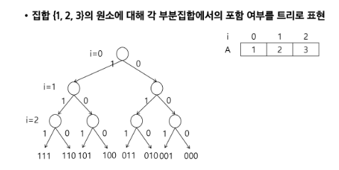
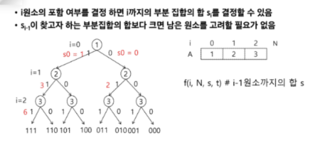
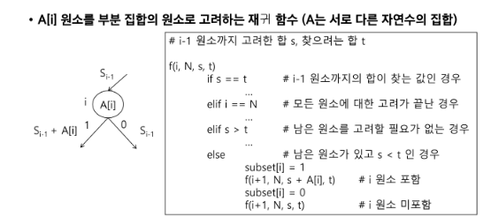
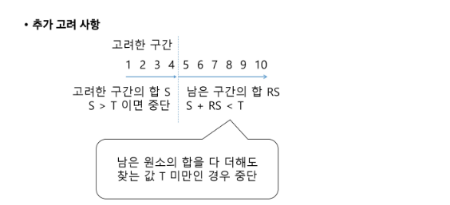
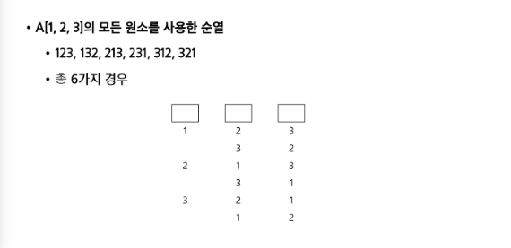
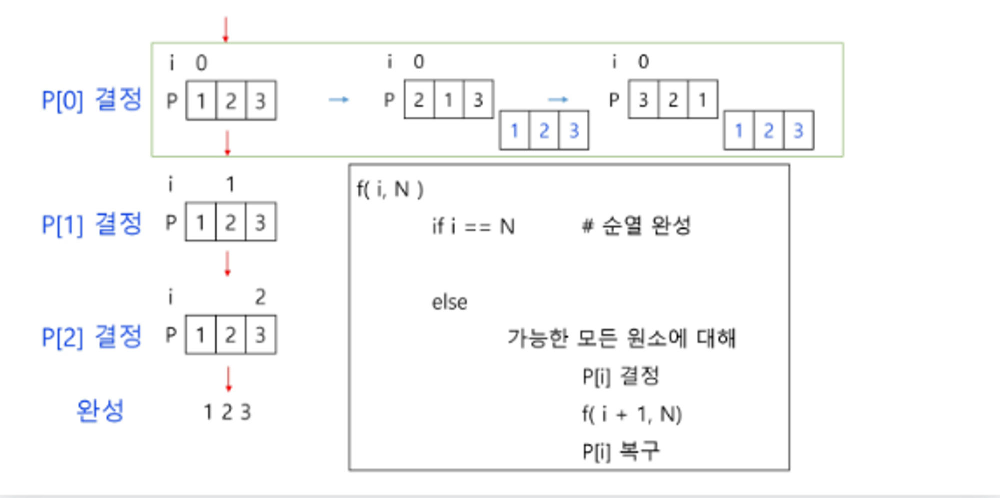
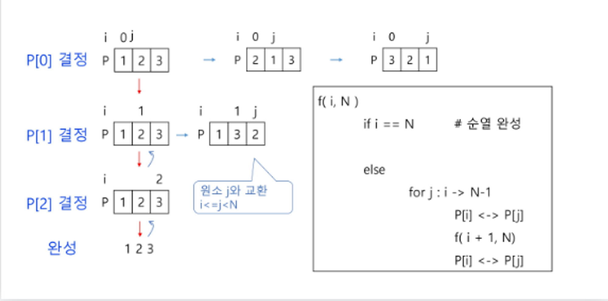
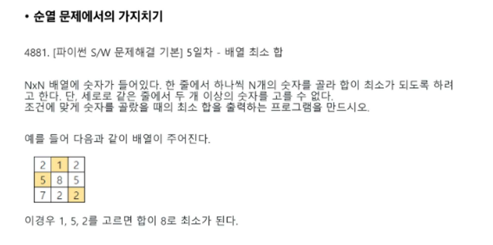

# 0809 stack2
### 오늘 실습을 통해 배운 내용

- 부분 집합
  - 어떤 집합의 공집합과 자기자신을 포함한 모든 부분집합을 powerset이라고 하며 구하고자 하는 어떤 집합의 원소 개수가 n일 경우 부분집합의 개수는 2^n개 이다.
  - 기존에 배운 방법으로 powerset 만들기
    ```python
    # 기존에 배운 loop 사용해서 생성
    # 각 원소가 부분집합에 포함되었는지를 확인하고 부분집합을 생성
    bit  = [0, 0, 0, 0]
    for i in range(2):
      bit[0] = i                # 0번째 원소
      for j in range(2):        
        bit[1] = j              # 1번째 원소
        for k in range(2):
          bit[2] = k            # 2번째 원소
          for l in range(2):
            bit[3] = l          # 3번째 원소
            print(bit)          # 생성된 부분집합 출력
    ```
  - 백트래킹 기법으로 powerset 만들기
    ```python
    # powerset을 구하는 백트래킹 알고리즘
    # a 주어진 배열
    # k 결정할 원소
    # n 원소 개수
    def backtrack(a, k, n):     
      c = [0] * MAXCANDIDATES   # 후보를 저장하려는 list

      if k == n:
        process_solution(a,k)     # 답이면 원하는 작업을 한다.
      else:
        ncandidates = construct_candidates(a, k, n, c)
        for i in range(ncandidates):
          a[k] = c[i]
          backtrack(a, k+1, n)
    
    def construct_candidates(a, k, n, c):
      c[0] = True
      c[1] = False
      return 2
    
    def process_solution(a, k):
      for i in range(k):
        if a[i]:
          print(num[i], end = '')
        print()
    
    MAXCANDIDATES = 2
    NMAX = 4
    a = [0] * NMAX
    num = [1, 2, 3, 4]
    backtrack(a, 0, 3)
    ```
  - [참고] 가지치기
    - 부분 집합의 합
    
    
    
    

- 순열
  - 단순하게 순열 생성하는 법
    ```python
    # 기존 방법
    # 3!
    for i1 in range(1, 4):
      for i2 in range(1, 4):
        if i2 != i1:
          for i3 in range(1,4):
            if i3 != i1 and i3 != i2 :
              print(i1, i2, i3)
    ```
  - 백트래킹으로 순열 생성
    ```python
    # 접근 방법은 앞의 부분집합 구하는 방법과 유사하다
    def backtrack(a, k, n):     
      c = [0] * MAXCANDIDATES   # 후보를 저장하려는 list

      if k == n:
        for i in range(0, k):
          print(a[i], end='')
        print()
      else:
        ncandidates = construct_candidates(a, k, n, c)
        for i in range(ncandidates):
          a[k] = c[i]
          backtrack(a, k+1, n)

    def construct_candidates(a, k, n, c):
      in_perm = [False] * (NMAX + 1)

      for i in range(k):
        in_perm[a[i]] = True
      
      ncandidates = 0
      for i in range(1, NMAX + 1):
        if in_perm[i] == False:
          c[ncandidates] = i
          ncandidates += 1
      return ncandidates
    
    MAXCANDIDATES = 3
    NMAX = 3
    a = [0] * NMAX
    backtrack(a, 0, 3)
    ```
  - [참고] 순열

    
    
    
    


링크 넣기 [Leaderboard 사진](https://www.vellum.ai/llm-leaderboard)
    
사진 넣기 

</br>

## A. 첫번째 문제 제목

* 주요 요구 사항 : 이 편지는 영국으로 부터 API 를 요청하여 데이터를 가져와 가공한 데이터...

* 결과 : 10명의 사람에게 보내지 않으면 ....
  
  * 기억해볼 부분
  
    ```
    배운 부분에 대한 코드 조각
    ```
  
    * 핵심 내용
    * 생각해본 다른 활용 법
  * 트러블 슈팅한 부분
  
    ```
    트러블 코드 조각
    ```
  
    * 트러블 현상 및 에러 정보
    * 원인 및 해결 방법

-----
</br>

## A. 첫번째 문제 제목

* 주요 요구 사항 : 이 편지는 영국으로 부터 API 를 요청하여 데이터를 가져와 가공한 데이터...

* 결과 : 10명의 사람에게 보내지 않으면 ....
  
  * 기억해볼 부분
  
    ```
    배운 부분에 대한 코드 조각
    ```
  
    * 핵심 내용
    * 생각해본 다른 활용 법
  * 트러블 슈팅한 부분
  
    ```
    트러블 코드 조각
    ```
  
    * 트러블 현상 및 에러 정보
    * 원인 및 해결 방법

-----
</br>

## A. 첫번째 문제 제목

* 주요 요구 사항 : 이 편지는 영국으로 부터 API 를 요청하여 데이터를 가져와 가공한 데이터...

* 결과 : 10명의 사람에게 보내지 않으면 ....
  
  * 기억해볼 부분
  
    ```
    배운 부분에 대한 코드 조각
    ```
  
    * 핵심 내용
    * 생각해본 다른 활용 법
  * 트러블 슈팅한 부분
  
    ```
    트러블 코드 조각
    ```
  
    * 트러블 현상 및 에러 정보
    * 원인 및 해결 방법

-----

</br>


## 오늘 후기

* 오늘 프로젝트는 쉬워 보였지만 나의 착각이었다.
* 고수가 되기 위해 오늘도 난 매진한다!
* 일단 롤 한 판 하고... 
* 라고 생각만 하고 열공해야겠다!


### 참고 사이트

* [파이썬 공식 문서 JSON 파트](https://docs.python.org/3.9/library/json.html)
* ...
