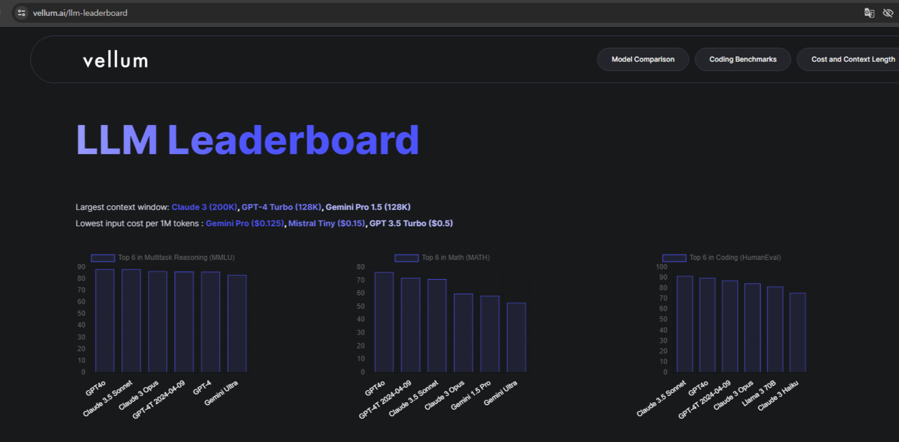

# AI 프롬프트 특강

### 생성형 인공지능이란?

생성형 인공지능 모델 vs  프로그래밍

공통점 : 개발자가 무엇을 입력으로 넣고 무엇을 출력할 지 설계

차이점 : 

#프로그래밍 - 입력과 출력의 관계에 대한 알고리즘을 직접 구현

#인공지능 - 모델은 입력과 출력의 관계를 데이터를 통해 학습

생성형 인공지능(Generative AI)

→텍스트, 이미지, 오디오, 비디오 등 새로운 콘텐츠를 생성할 수 있는 인공지능 기술

대표적인 생성형 인공지능 알고리즘

#VAE, GAN, Diffusion(DALL-E)→연속적인 

#Transformer Decoder→연속적이지 않은

단계적으로 생성하게 되면 시간이 오래 걸린다는 단점

프롬프트(Prompt)

→생성형 AI에 주어지는 입력데이터로, 생성형 AI가 출력할 컨텐츠의 내용 및 스타일 등을 안내하는 역할을 수행

#텍스트 생성 AI - ChatGPT(OpenAI), Gemini(Google), Claude(Anthropic)-코드 생성에 좋다

#이미지 생성 AI - DALL-E, Midjourney, Stable Diffusion Web UI

#동영상 생성 AI - Pixverse, Haiperai, Sora(OpenAI에서 출시 예정), Gen3

#음악 생성 AI - Suno, Udio

---

## LLM이란?

→Large Language Model(대규모 언어 모델)

→텍스트 생성, 번역, 질문 답변, 요약 등 다양한 언어 관련 작업을 하나의 모델에서 수행

| 회사 | 모델 | 출시 연도 | 파라미터 수(=뉴런) | 최대 입력 토큰(단어) 수 | 특징 |
| --- | --- | --- | --- | --- | --- |
| OpenAI | GPT-3.5 | 2022 | 1750억 | 4,096 ~ 16,385 | 텍스트 기반 LLM 모델,높은 언어 작업 성능 |
|  | GPT-4 | 2023 | 1~1.7조 추정 | 8,192 ~ 128,000 | 향상된 언어 작업 성능, 멀티모달 입력 처리, 긴 문맥 이해 |
|  | GPT-4o | 2024 | 비공개 | 128,000 | 향상된 멀티모달 입력 처리, 실시간 대화, 효율적인 성능 및 처리 속도 |
| Google | Geimini 1.5 | 2024 | 1.5조개 추정 | 128,000 ~ 1,000,000 | 멀티모달, 긴 문맥 이해, Mixture-of-Experts 아키텍쳐 |
| Meta (Facebook) | LLaMA3 | 2024 | 80-700억(최적화로 인해 줄어듬) | 8,000 | 무료 오픈 소스 LLM 모델, 실시간 대화, 효율적인 성능 |
- 멀티모달(Multi-Modal) : 여러 유형의 데이터를 동시에 처리하고 상호 작용할 수 있는

- LLM 성능 리더보드(다양한 LLM에 대한 성능 비교)
    
    → [https://www.vellum.ai/llm-leaderboard](https://www.vellum.ai/llm-leaderboard)
    
    
    

LLM의 원리

→입력[프롬프트]과 출력 사이의 조건부 확률 분포를 학습합니다.

→새로운 입력이 주어졌을 때 학습된 조건부 확률 분포를 통해 모든 토큰[단어]별 확률을 예측하고, 그 중 가장 가능성이 높은 토큰을 선택하여 답변합니다

#몬티홀 문제            #베이즈 정리

자연어 생성 인공지능 모델에서의 조건부 확률 분포

→입력[프롬프트]가 주어졌을 때 모든 단어[토큰]별 확률을 나타내는 함수

→다음 단어를 예측하기 위해 그 중에서 확률이 가장 높은 단어[토큰]를 선택

→P(World | “The cat sat on the”)

→똑같은 입력에 다른 답변이 나오는 이유 : 확률값에 따라서 샘플링하기 때문에 (랜덤 선정)

→temperature을 통해 확률 조정 가능

GPT 모델의 단어 생성 원리

→모델 구조 : Transformer Decoder(’Attention Is All You Need”, 2017, NeurIPS)

→Autoregressive 원리 : 이전 시점의 출력이 현재 시점의 입력으로 사용되면서 시퀀스를 예측하는 방식

LLM의 한계점

GPT는 실제로 계산을 할까? (X)       →ChatGPT는 외부 도구를 활용하여 수학적 계산을 처리함!

→학습 데이터 분포 내의 입력(In-Distribution) : 훈련 데이터의 분포 내에 있는 새로운 데이터는 정확하게 예측할 가능성이 큼

→학습 데이터는 벗어나는 입력(Out-of-Distribution) : 학습 데이터 분포를 벗어나는 입력은 신뢰할 수 없는 출력을 생성할 가능성이 큼

→데이터 편향(Data Bias) : 학습 데이터의 편향으로 인해 특정한 관점이나 답변을 더 자주 생성할 가능성이 큼

→데이터 오류(Data Error) :  잘못된 정보나 오류가 포함된 학습 데이터는 모델이 부정확하거나 잘못된 출력을 지속적으로 생성

### LLM의 학습 방법

사전 학습(Pre-training)

→입력 텍스트의 다음 단어를 예측하는 훈련

→방법 : 주어진 문맥x1,x2,x3….xn-1에서 다음 단어의 조건부 확률P(x1 } x1x2…xn-1)을 극대화

→학습 장점 : 입력에 따른 정답 데이터 셋을 따로 구축하지 않아도 됨(Self-Supervised Learning)

→학습 내용 : 

1. 문법 이해 : 자연스럽고 정확한 문장을 생성
2. 문맥 이해 : 문맥에 맞는 단어를 예측하여 일관성 있는 텍스트 생성
3. 지식 활용 : 일반 상식과 지식을 바탕으로 정보 제공
4. 감정 분석 : 텍스트의 감정적 톤을 파악하고 적절한 단어 선택

→학습용 데이터 셋 : 인터넷에서 수집된 방대한 양의 텍스트 데이터 등

#Wikipedia, 학술 논문, 뉴스, 전자책, 인터넷 크롤링 등

파인튜닝(Fine-tuning) : 사전 학습된 모델을 특정 작업에 맞게 재학습하는 과정

→Instruction Learning : 주어진 지시문(명령어)를 이해하고 수행하도록 학습

→방법 : 다양한 작업에 대한 명령어와 그에 맞는 예시 답변을 포함한 데이터 셋을 통해 조건부 활률 P(예시 답변 | 지시문)을 최대화하도록 학습

→학습의 장점 : 동일한 모델로 다양한 기능을 수행 및 범용성 향상

→학습 내용 : 자동 번역, 문서 요약, 문법 교정, 질의 응답, 코드 생성, 코드 디버깅 등

### 기술적 한계점과 해결방안

모호한 지시처리 : 다양한 해석을 할 수 있는 질문이나 지시에 대해 명확한 답변을 제공하지 못 할 수 있음

→질문에 대한 배경과 세부 정조, 구체적인 답변 예시 등을 통해 사용자가 원하는 답변을 할 수 있도록 유도

맥락 유지의 어려움 : 긴 대화나 복잡한 문맥을 지속적으로 유지하는데 어려움을 겪음

→LLM이 처리할 수 있는 최대 토큰 수는 정해져 있으므로, 기존의 질문 및 답변의 핵심적인 정보들을 요약하여 맥락을 유지할 수 있도록 함

할루시네이션(Hallucination) : 문맥에 맞는 듯 보이지만 실제로는 근거 없는 내용을 생성하는 현상으로, 사용자에게 잘못된 정보를 제공할 수 있음

→외부 지식 및 데이터 베이스의 내용을 프롬프트에 넣어 해당 내용에 근거해 답변을 생성하도록 함(RAG, Retrieval-Augmented-Generation)

정보의 한계 : 최신 정보 및 새로운 전문적인 지식을 제공하지 못함

→질문에 대한 내용을 인터넷에서 검색 후 LLM이 인터넷의 내용을 기반으로 답변을 생성하도록 함

---

### ChatGPT 소개

→질문 응답, 텍스트 생성, 언어 번역, 코딩 지원, 데이터 분석 및 시각화, 정보 검색

GPT Store

→수학 계산 특화, 전문 문헌 리뷰, 다양한 생성 AI 등 GPT\를 활용한 다양한 서비스 제공

올바른 ChatGPT 사용법

1. 구체적이고 명확한 질문 및 배경 정보 제공하기
2. 추가 질문으로 원하는 정보를 이끌어 나가며 이어나가기
3. 대화의 주제가 달라진 경우 새로운 채팅창 이용하기
4. 사실 확인 및 평가하기
    
    #이 코드가 정확한지 확인하기 위해 Python 공식 사이트의 문건을 참조해보고 문법적 오류가 있는지 스스로 평가해보세요
    

---

### 프롬프트 엔지니어링

→최적의 응답을 생성하도록 입력 프롬프트를 설계하고 조정하는 과정(LLM 활용 서비스 구축 시 필수 기술)

프롬프트 엔지니어링 과정

→작업 내용에 대한 이해를 바탕으로 LLM과 협력하면서 원하는 결과물을 창출하는 과정

#프롬프트(나의 문제 이해)

프롬프트 엔지니어링 실습

→나만의 노래 만들기

→줄임말 순화 프로그램 만들기